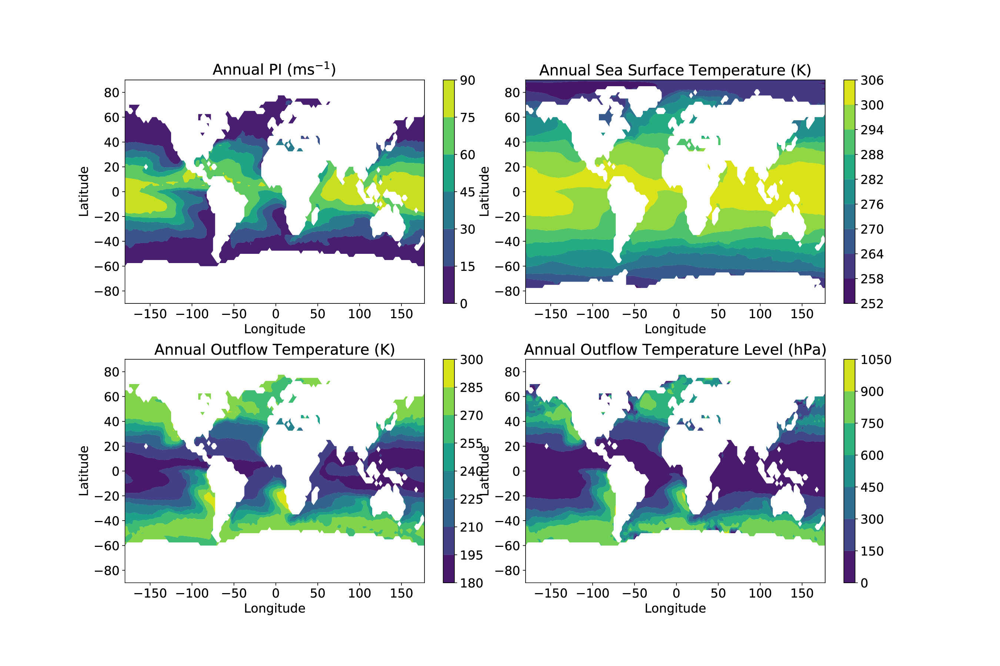

# pyPI: Potential Intensity Calculations in Python
<p align="center">

</p>

pyPI is a set of scripts and notebooks that compute and validate tropical cyclone (TC) potential intensity (PI) calculations in Python.
It is a fully documented and improved port of the [Bister and Emanuel 2002](https://agupubs.onlinelibrary.wiley.com/doi/full/10.1029/2001JD000776) algorithm (hereafter BE02) which was originally written in FORTRAN---and then MATLAB---by Prof. Kerry Emanuel (MIT).
Kerry's original MATLAB code (**pcmin.m**) is found at:

* [http://texmex.mit.edu/pub/emanuel/TCMAX](http://texmex.mit.edu/pub/emanuel/TCMAX)

The goals in developing and maintaining pyPI are to:
* supply a freely available validated Python potential intensity calculator,
* carefully document the BE02 algorithm and its Python implementation, and to
* demonstrate and encourage the use of potential intensity theory in tropical cyclone climatology analysis.

If you have any questions, comments, or feedback, please [contact the developer](mailto:daniel.gilford@rutgers.edu) or open an [Issue](https://github.com/dgilford/pyPI/issues) in the repository.

## Citation
pyPI was developed by [Daniel Gilford](https://github.com/dgilford) and has been archived on Zenodo:

[](https://zenodo.org/badge/latestdoi/247725622)

If you use pyPI in your work, please include the citation:
```
Gilford, D. M. 2020: pyPI: Potential Intensity Calculations in Python, v1.2, Zenodo, doi:10.5281/zenodo.3900548.
```

## Full pyPI Description

Please read [pyPI_Users_Guide_v1.3.pdf](pyPI_Users_Guide_v1.3.pdf) for a full overview and details on pyPI.
The description includes the pyPI background, a PI computation derivation, validation against the commonly-used MATLAB algorithm (pcmin), and a set of sample analyses.

A manuscript detailing the development of pyPI is be prepared for submission.

## Getting Started

pyPI requires **Python version 3.7+** to run. It was written and tested with Python 3.7.6.
To get pyPI up and running on your system, clone the repository and ensure that you have the required dependencies.

### Installation

Use the python package manager [pip](https://pip.pypa.io/en/stable/) to install pyPI (tcpypi) from the command line:

```bash
pip install tcpypi
```

### pyPI Dependencies

* NumPy 1.18.1
* [Numba](http://numba.pydata.org/) 0.48.0
* [xarray](http://xarray.pydata.org/) 0.15.1

### Python Implementation of "pc_min" (BE02 PI Calculator)

[pi.py](pi.py) is the Python function which directly computes PI given atmospheric and ocean state variables (akin to the BE02 algorithm MATLAB implementation [pc_min.m](pc_min.m)). Given input vector columns of environmental atmospheric temperatures (T) and mixing ratios (R) on a pressure grid (P), sea surface temperatures (SST), and mean sea-level pressures (MSL), the algorithm outputs potential intensity, the outflow level, the outflow temperature, and the minimum central pressure, and a flag that shows the status of the completed PI calculation. pyPI is an improvement on pcmin in that it handles missing values depending on user input flags.

Users who want to apply the PI calculation to a set of local environmental conditions need only to download pi.py, organize their data appropriately, and call the function to return outputs, e.g.:
```
(VMAX,PMIN,IFL,TO,LNB)=pi(SST,MSL,P,T,R)
```

### Running a pyPI Sample

Included in the pyPI release is a sample script [run_sample.py](run_sample.py) which runs global sample data from MERRA2 (in 2004) through pi.py, vectorizes the output, and performs several simple analyses. To run, simply:
```
python run_sample.py
```
and examine the outputs locally produced in [full_sample_output.nc](./data/full_sample_output.nc).

## File Descriptions

#### Key files
* **[pi.py](./pyPI/pi.py)** - The primary function of pyPI, that computes and outputs PI (and associated variables) given atmospheric and ocean state variables.
* **[run_sample.py](run_sample.py)** - Example script that computes PI and accompanying analyses over the entire sample dataset

#### Data
* [sample_data.nc](./data/sample_data.nc) - Sample atmospheric and ocean state variable data and BE02 MATLAB output data; values are monthly averages over the globe from MERRA2 in 2004.
* [mdr.pk1](./data/mdr.pk1) - Python pickled dictionary containing Main Development Region definitions from [Gilford et al. (2017)](https://journals.ametsoc.org/doi/abs/10.1175/JCLI-D-16-0827.1)
* [raw_sample_output.nc](./data/raw_sample_output.nc) - Sample outputs from pi.py *only* created by run_sample.py
* [full_sample_output.nc](./data/full_sample_output.nc) - Full set of sample outputs from pi.py as well as sample analyses such as PI decomposition

#### Validation and Testing Notebooks
* **[test_pi_calc.ipynb](./notebooks/test_pi_calc.ipynb)** - Simple code showing a single call of pi.py and testing the speed of the algorithm
* **[verify_pi.ipynb](./notebooks/verify_pi.ipynb)** - Notebook validating/verifying pyPI outputs against BE02 MATLAB output data
* **[sample_output_analyses.ipynb](./notebooks/sample_output_analyses.ipynb)** - Notebook showing examples of pyPI outputs and simple PI analyses

#### Misc.
* **[utilities.py](./pyPI/utilities.py)** - Set of functions used in the pyPI codebase
* **[constants.py](./pyPI/constants.py)** - Set of meteorological constants used in the pyPI codebase
* **[reference_calculations.m](./matlab_scripts/reference_calculations.m)** - Script used to generate sample BE02 MATLAB outout data from original MERRA2 files monthly mean; included for posterity and transperancy
* **[pc_min.m](./matlab_scripts/pc_min.m)** - Original BE02 algorithm from MATLAB, adapted and used to produce analyses of Gilford et al. ([2017](https://journals.ametsoc.org/doi/abs/10.1175/JCLI-D-16-0827.1); [2019](https://journals.ametsoc.org/doi/10.1175/MWR-D-19-0021.1))
* **[clock_pypi.ipynb](./notebooks/clock_pypi.ipynb)** - Notebook estimating the time it takes to run pyPI on a laptop

## Author

* **Daniel M. Gilford, PhD** - *Development & Maintenance* - [GitHub](https://github.com/dgilford)

### Contributor(s)
* **Daniel Rothenberg, PhD** - *Numba Optimization & Sample Code* - [GitHub](https://github.com/darothen)

## License

This project is licensed under the MIT License - see the [LICENSE](LICENSE) file for details

## Acknowledgments

* Kerry Emanuel (MIT) - Development of potential intensity theory; encouragement and permission to pursue Python implementation
* Susan Solomon (MIT), Paul O'Gorman (MIT), Allison Wing (FSU) - Helpful conversations, advice, and suggestions on TC PI research
* Dan Chavas (Purdue), Jonathan Lin (MIT), Raphael Rousseau-Rizzi (MIT) - Feedback on pyPI code and documentation
