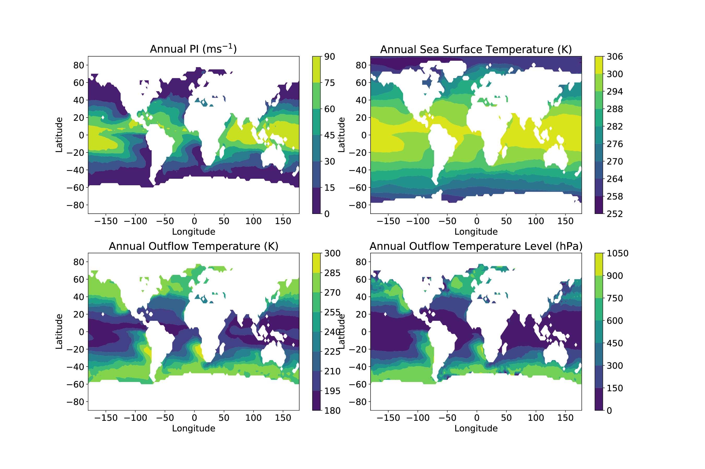

# tcpyPI: Potential Intensity Calculations in Python
<p align="center">

</p>

tcpyPI, 'pyPI' for short, is a set of scripts and notebooks that compute and validate tropical cyclone (TC) potential intensity (PI) calculations in Python.
It is a fully documented and improved port of the [Bister and Emanuel 2002](https://agupubs.onlinelibrary.wiley.com/doi/full/10.1029/2001JD000776) algorithm (hereafter BE02) which was originally written in FORTRAN---and then MATLAB---by Prof. Kerry Emanuel (MIT).
Kerry's original MATLAB code (**pcmin.m**) is found at:

* [http://texmex.mit.edu/pub/emanuel/TCMAX](http://texmex.mit.edu/pub/emanuel/TCMAX)

The goals in developing and maintaining pyPI are to:
* supply a freely available validated Python potential intensity calculator,
* carefully document the BE02 algorithm and its Python implementation, and to
* demonstrate and encourage the use of potential intensity theory in tropical cyclone climatology analysis.

If you have any questions, comments, or feedback, please [contact the developer](mailto:dgilford@climatecentral.org) or open an [Issue](https://github.com/dgilford/pyPI/issues) in the repository. A paper detailing pyPI is published [at Geoscientific Model Development](https://gmd.copernicus.org/articles/14/2351/2021/gmd-14-2351-2021.pdf).

## Citation
pyPI was developed by [Daniel Gilford](https://github.com/dgilford) and has been archived on Zenodo:

[](https://zenodo.org/badge/latestdoi/247725622)

If you use pyPI in your work, please include the citations:

> Gilford, D. M.: pyPI (v1.3): Tropical Cyclone Potential Intensity Calculations in Python, Geosci. Model Dev., 14, 2351–2369, https://doi.org/10.5194/gmd-14-2351-2021, 2021.

and

> Gilford, D. M. 2020: pyPI: Potential Intensity Calculations in Python, pyPI v1.3. Zenodo. http://doi.org/10.5281/zenodo.3985975


## Full pyPI Description

Please read [pyPI_Users_Guide_v1.3.pdf](pyPI_Users_Guide_v1.3.pdf) for a full overview and details on pyPI.
The description includes the pyPI background, a PI computation derivation, validation against the commonly-used MATLAB algorithm (pcmin), and a set of sample analyses.

## Getting Started

pyPI requires **Python version 3.7+** to run.
To get pyPI up and running on your system, clone the repository and ensure that you have the required dependencies.

### Installation

pyPI is packaged using the python package manager [pip](https://pip.pypa.io/en/stable/).

[](https://badge.fury.io/py/tcpypi)

To install tcpypi from the command line:

```bash
pip install tcpypi
```

### tcpyPI Dependencies

* NumPy
* [Numba](http://numba.pydata.org/)

Not required by tcpyPI---but highly recommended!---is the versatility in calculating PI over large datasets provided by [xarray](http://xarray.pydata.org/en/stable/).
Dependency versions were originally handled by [Dependabot](https://dependabot.com/), but the code was not resilient to these changes so they are currently defunct (as of 10 August 2022). Please [notify me](mailto:dgilford@climatecentral.org) immediately if installation problems persist.

### Python Implementation of "pc_min" (BE02 PI Calculator)

[pi.py](src/tcpyPI/pi.py) is the Python function which directly computes PI given atmospheric and ocean state variables (akin to the BE02 algorithm MATLAB implementation [pc_min.m](matlab_scripts/pc_min.m)). Given input vector columns of environmental atmospheric temperatures (T) and mixing ratios (R) on a pressure grid (P), sea surface temperatures (SST), and mean sea-level pressures (MSL), the algorithm outputs potential intensity, the outflow level, the outflow temperature, and the minimum central pressure, and a flag that shows the status of the completed PI calculation. pyPI is an improvement on pcmin in that it handles missing values depending on user input flags.

Users who want to apply the PI calculation to a set of local environmental conditions need only to download [pi.py](./src/tcpyPI/pi.py), organize their data appropriately, and call the function to return outputs, e.g.:
```
(VMAX,PMIN,IFL,TO,LNB)=pi(SST,MSL,P,T,R)
```

### Sensitivity & Configuration Options

`tcpyPI.pi()` exposes a few key “sensitivity knobs” that can materially change results. The most commonly explored options are:

- `CKCD` (default `0.9`): exchange coefficient ratio (`Ck/Cd`).
- `diss_flag` (default `1`): include (`1`) or exclude (`0`) dissipative heating.
- `ascent_flag` (default `0`): reversible (`0`) vs pseudo-adiabatic (`1`) ascent assumption.
- `V_reduc` (default `0.8`): reduction from gradient wind to 10 m wind speed.
- `ptop` (default `50` hPa): top pressure bound; setting too high can bias outflow level/temperature.
- `miss_handle` (default `1`): missing-profile handling; `1` returns missing on any NaNs.
- `outflow_source` (default `"cape_star"`): how outflow level/temperature are defined:
  - `"cape_star"`: outflow is the LNB (`OTL`) and temperature (`T0`) from the saturated CAPE* calculation (default; BE02/pcmin behavior).
  - `"cape_env"`: outflow is the LNB and temperature from the environmental CAPE (CAPEenv) on the final convergence iteration (see Gilford et al. 2021 discussion).

Example:

```python
from tcpyPI import pi

vmax, pmin, ifl, t0, otl = pi(SSTC, MSL, P, TC, R, CKCD=0.9, diss_flag=1, outflow_source="cape_env")
```

### Log Decomposition (Wing et al. 2015)

tcpyPI provides a simple API for log-decomposing PI into efficiency, disequilibrium, and `Ck/Cd` terms (where `lnpi = ln(V^2)`):

```python
from tcpyPI import log_decompose_pi, pi_log_decomposition

out = pi_log_decomposition(SSTC, MSL, P, TC, R, CKCD=0.9)  # SSTC/TC in Celsius
lnpi, lneff, lndiseq, lnCKCD = log_decompose_pi(out["vmax"], SSTC, out["t0"], CKCD=0.9, sst_units="C")
```

### Ventilation Index (Tang & Emanuel 2012) (EXPERIMENTAL)

tcpyPI includes an **experimental** implementation of the Tang & Emanuel (2012) ventilation index:

Equations (TE12):

$$\Lambda = \left(\frac{V_{\mathrm{shear}}}{V_{PI}}\right)\,\chi_m$$

$$\chi_m = \frac{s_m^* - s_m}{s_{SST}^* - s_b}$$

where $V_{\mathrm{shear}}$ is the 850–200 hPa shear magnitude (m/s), $V_{PI}$ is potential intensity (m/s),
and $s_m^{\ast}, s_m, s_{SST}^{\ast}, s_b$ are moist entropies (e.g., $J\,kg^{-1}\,K^{-1}$) defined in TE12.

```python
import tcpyPI

# χm from a thermodynamic profile (TE12 Eq. 2)
chi_m = tcpyPI.entropy_deficit_te12_from_profile(
    P, TC, R, T_units="C", q_units="g/kg",
    SST=SSTC, SST_units="C", psfc_hpa=MSL,
    T2m=TC[0], q2m=R[0],
    entropy_method="emanuel94",                # or "bryan2008" (TE12-consistent)
    s_m_star_source="env_T_at_pmid",           # or "moist_adiabat_from_sst"
    sb_source="t2m",                           # or "layer_1000_900", "lowest_level"
    p_mid_hpa=600.0,
)

# Λ from shear and PI (TE12 Eq. 1)
Lambda = tcpyPI.ventilation_index(u_shear, VMAX, chi_m, formulation="te12")
```

Key options:
- `entropy_method`: `"emanuel94"` (default; consistent with most of tcpyPI) or `"bryan2008"` (matches TE12 Eq. 3).
- `s_m_star_source`: `"env_T_at_pmid"` (default) or `"moist_adiabat_from_sst"` (saturated parcel lifted from SST to `p_mid_hpa`).
- `sb_source`: `"t2m"` (default; uses `T2m/q2m` at `psfc_hpa`), with fallbacks available via `sb_fallback`.

See `notebooks/ventilation_index_demo.ipynb` for a step-by-step worked example and visualization.

### Power Dissipation Index (PDI) (EXPERIMENTAL)

tcpyPI includes an **experimental** Power Dissipation Index (PDI) utility for storm-track time series:

Equations (Emanuel 2005):

$$\mathrm{PDI} = \sum_{t} V_{\max}(t)^3\,\Delta t$$

where $V_{\max}$ is the maximum sustained wind speed and $\Delta t$ is the time step. The
`"e05_si"` formulation returns the SI-consistent sum (e.g., $m^3\,s^{-2}$ if $V$ is m/s and $\Delta t$ is s),
and `"e05_1e11"` returns `PDI / 1e11` for plotting convenience.

```python
import tcpyPI

# Vmax time series (example: m/s) and time step (example: hours)
PDI = tcpyPI.power_dissipation_index(
    vmax_series,
    dt_hours,
    wind_units="m/s",    # or "kt"
    dt_units="h",        # or "s"
    formulation="e05_si" # or "e05_1e11" (scaled for plotting)
)
```

Options:
- `nan_policy`: `"propagate"` (default) returns NaN if any timestep is missing; `"omit"` drops missing contributions.
- `dt` may be a scalar (constant timestep) or an array broadcastable to `vmax_series` (variable timestep).

See `notebooks/power_dissipation_index_demo.ipynb` for an end-to-end example using observed intensity from IBTrACS (Hurricane Milton, 2024) and computing PDI.

### Relative Intensity (ν)

tcpyPI provides a small helper for **relative intensity**, commonly defined as:

$$\nu(t) = V_{\max}(t) / V_{PI}(t)$$

where $\nu$ is unitless, $V_{\max}$ is the storm intensity, and $V_{PI}$ is the local potential intensity.

Example:

```python
import tcpyPI

nu = tcpyPI.relative_intensity(vmax_series, vpi_series)
```

### Genesis Potential Index (GPI) (EXPERIMENTAL)

tcpyPI includes an **experimental** Genesis Potential Index (GPI) utility:

Equations (as implemented here; see Emanuel & Nolan 2004; Camargo et al. 2007):

For `"en04"`:

$$\mathrm{GPI} = \left(10^5\,|\eta|\right)^3\,\left(\frac{\mathrm{RH}}{50}\right)^3\,\left(\frac{V_{PI}}{70}\right)^3\,\left(1 + 0.1\,V_{\mathrm{shear}}\right)^{-2}$$

For `"c07"` (PI-thresholded variant):

$$\mathrm{GPI} = \left(10^5\,|\eta|\right)^3\,\left(\frac{\mathrm{RH}}{50}\right)^3\,\left(\frac{\max(V_{PI}-35,\,0)}{70}\right)^3\,\left(1 + 0.1\,V_{\mathrm{shear}}\right)^{-2}$$

where $|\eta|$ is low-level absolute vorticity ($s^{-1}$; commonly 850 hPa), RH is midlevel relative humidity (%; commonly 700 hPa),
$V_{\mathrm{shear}}$ is deep-layer shear magnitude (m/s; commonly 850–200 hPa), and $V_{PI}$ is potential intensity (m/s).

```python
import tcpyPI

# Inputs (typical choices):
# - abs_vort: |η| at ~850 hPa (s^-1)
# - rh_mid: RH at ~700 hPa (%)
# - v_shear: 850–200 hPa shear magnitude (m/s)
# - v_pot: potential intensity (m/s), e.g. from tcpyPI.pi()

gpi_en04 = tcpyPI.genesis_potential_index(abs_vort, rh_mid, v_shear, v_pot, formulation="en04")
gpi_c07 = tcpyPI.genesis_potential_index(abs_vort, rh_mid, v_shear, v_pot, formulation="c07")
```

Formulations:
- `"en04"`: Emanuel & Nolan (2004)-style
- `"c07"`: Camargo et al. (2007)-style variant with PI thresholding

See `notebooks/genesis_potential_index_demo.ipynb` for an end-to-end worked example.

### Running a pyPI Sample

Included in the pyPI release is a sample script [run_sample.py](run_sample.py) which runs global sample data from MERRA2 (in 2004) through pi.py, vectorizes the output, and performs several simple analyses. To run, simply:
```
python run_sample.py
```
and examine the outputs locally produced in [full_sample_output.nc](./data/full_sample_output.nc).

## File Descriptions

#### Key files
* **[pi.py](./src/tcpyPI/pi.py)** - The primary function of pyPI, that computes and outputs PI (and associated variables) given atmospheric and ocean state variables.
* **[run_sample.py](run_sample.py)** - Example script that computes PI and accompanying analyses over the entire sample dataset

#### Data
* [sample_data.nc](./data/sample_data.nc) - Sample atmospheric and ocean state variable data and BE02 MATLAB output data; values are monthly averages over the globe from MERRA2 in 2004.
* [mdr.json](./data/mdr.json) - Main Development Region definitions from [Gilford et al. (2017)](https://journals.ametsoc.org/doi/abs/10.1175/JCLI-D-16-0827.1)
* [raw_sample_output.nc](./data/raw_sample_output.nc) - Sample outputs from pi.py *only* created by run_sample.py
* [full_sample_output.nc](./data/full_sample_output.nc) - Full set of sample outputs from pi.py as well as sample analyses such as PI decomposition

#### Validation and Testing Notebooks
* **[test_pi_calc.ipynb](./notebooks/test_pi_calc.ipynb)** - Simple code showing a single call of pi.py and testing the speed of the algorithm
* **[verify_pi.ipynb](./notebooks/verify_pi.ipynb)** - Notebook validating/verifying pyPI outputs against BE02 MATLAB output data
* **[sample_output_analyses.ipynb](./notebooks/sample_output_analyses.ipynb)** - Notebook showing examples of pyPI outputs and simple PI analyses
* **[ventilation_index_demo.ipynb](./notebooks/ventilation_index_demo.ipynb)** - Experimental TE12 ventilation index: end-to-end calculation and diagnostics
* **[power_dissipation_index_demo.ipynb](./notebooks/power_dissipation_index_demo.ipynb)** - Experimental PDI: synthetic track + PI-derived winds + integrated PDI
* **[genesis_potential_index_demo.ipynb](./notebooks/genesis_potential_index_demo.ipynb)** - Experimental GPI: worked example and sensitivities

#### Misc.
* **[utilities.py](./src/tcpyPI/utilities.py)** - Set of functions used in the pyPI codebase
* **[constants.py](./src/tcpyPI/constants.py)** - Set of meteorological constants used in the pyPI codebase
* **[vi.py](./src/tcpyPI/vi.py)** - Experimental TE12 ventilation index and entropy deficit utilities
* **[pdi.py](./src/tcpyPI/pdi.py)** - Experimental power dissipation index utility
* **[gpi.py](./src/tcpyPI/gpi.py)** - Experimental genesis potential index utility
* **[reference_calculations.m](./matlab_scripts/reference_calculations.m)** - Script used to generate sample BE02 MATLAB output data from original MERRA2 files monthly mean; included for posterity and transparency
* **[pc_min.m](./matlab_scripts/pc_min.m)** - Original BE02 algorithm from MATLAB, adapted and used to produce analyses of Gilford et al. ([2017](https://journals.ametsoc.org/doi/abs/10.1175/JCLI-D-16-0827.1); [2019](https://journals.ametsoc.org/doi/10.1175/MWR-D-19-0021.1))
* **[clock_pypi.ipynb](./notebooks/clock_pypi.ipynb)** - Notebook estimating the time it takes to run pyPI on a laptop

## Author

* **Daniel M. Gilford, PhD** - *Creation, Development, & Maintenance* - [GitHub](https://github.com/dgilford)

### Contributor(s)
* **Ben Mares** - *Modernization* - [GitHub](https://github.com/maresb)
* **Daniel Rothenberg, PhD** - *Numba Optimization & Sample Code* - [GitHub](https://github.com/darothen)

## License

This project is licensed under the MIT License - see the [LICENSE](LICENSE) file for details

## Acknowledgments

* Kerry Emanuel (MIT) - Development of potential intensity theory; encouragement and permission to pursue Python implementation
* Susan Solomon (MIT), Paul O'Gorman (MIT), Allison Wing (FSU) - Helpful conversations, advice, and suggestions on TC PI research
* Dan Chavas (Purdue), Jonathan Lin (MIT), Raphael Rousseau-Rizzi (MIT) - Feedback on pyPI code and documentation
